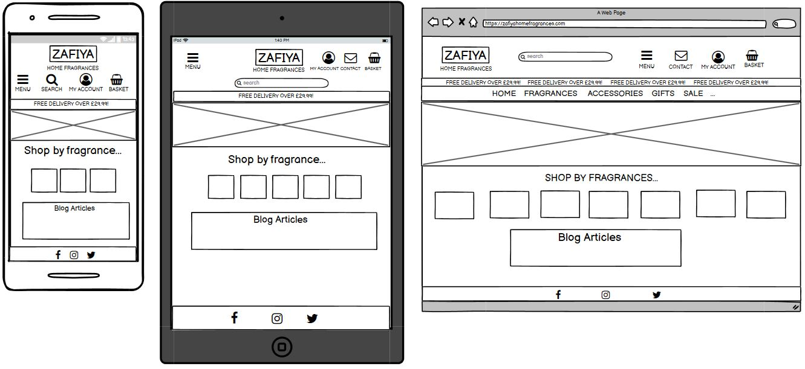

<h1 align="center">Zafiya Home Fragrances MS4</h1>

## Contents
1. [User Experience](#user-experience-ux)
2. [Features](#features)
3. [Technologies Used](#technologies-used)
4. [Testing](#testing)
5. [Deployment](#deployment)
6. [Credits](#credits)

## User Experience (UX)
***
- ### User Stories
    * Viewing and navigation.
        1. I would like to be able navigate quickly around the site with it being self explanatory.
        2. I would want to see products clustered into categories.
    * Registration and user accounts.
        1. I would like to register for an account.
        2. I would want to be able to log in and log out.
        3. I would like to update and delete my personal details.
        4. I would like to see my past orders.
    * Purchasing and checkout.
        1. I would like to add items to the basket and see an overview of their total prices.
        2. I would like to get to the checkout using my basket.
        3. I would like to pay for my order using a safe checkout.
    * Admin goals;
        1. I would like to create and manage products to the store.
        

- ### Wireframes
    

Landing Page Wireframe:

        
    
    

- ### Design
    - #### Color Scheme
        
    - #### Typography

## Features
***

## Technologies Used
***

## Testing
***

* ### Supported screens and browsers.

* ### Fixed bugs.

## Deployment
***

## Credits
***
 - ### Code

 - ### Acknowledgements
